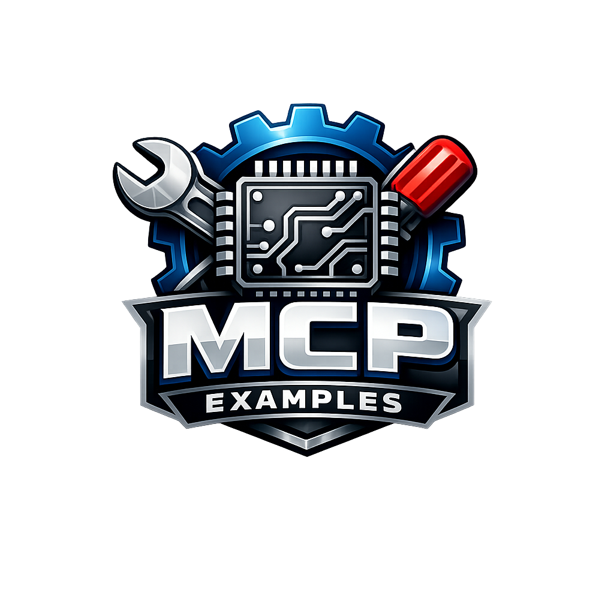

<p align="center">
  <a href="README.ja.md">日本語</a> | <a href="README.zh.md">中文</a> | <a href="README.es.md">Español</a> | <a href="README.fr.md">Français</a> | <a href="README.hi.md">हिन्दी</a> | <a href="README.it.md">Italiano</a> | <a href="README.pt-BR.md">Português (BR)</a>
</p>

<p align="center">
  
</p>

<p align="center">
  <a href="https://github.com/mcp-tool-shop-org/mcp-examples/actions/workflows/validate.yml"></a>
  <a href="LICENSE"></a>
  <a href="https://mcp-tool-shop-org.github.io/mcp-examples/"></a>
</p>

Ejemplos de entornos de trabajo para [MCP Tool Shop](https://github.com/mcp-tool-shop).

## Cómo se integra MCP Tool Shop

- **Registro** ([mcp-tool-registry](https://github.com/mcp-tool-shop-org/mcp-tool-registry)) → qué herramientas existen.
- **CLI** ([mcpt](https://github.com/mcp-tool-shop-org/mcpt)) → cómo las utilizas.
- **Ejemplos** → cómo aprendes a usar el sistema (este repositorio).
- **Etiquetas** (v0.1.0, v0.2.0) → estabilidad, reproducibilidad.
- **main** → solo para desarrollo; puede cambiar sin previo aviso; las compilaciones pueden fallar.
- **Las herramientas funcionan con el principio de mínimo privilegio** → sin acceso a la red, sin escritura, sin efectos secundarios.
- **La funcionalidad siempre es explícita y opcional** → tú decides cuándo habilitarla.

## Ejemplos

| Ejemplo | Descripción |
| --------- | ------------- |
| [hello-tools](./hello-tools/) | Tu primer entorno de trabajo de MCP en 2 minutos. |
| [hello-filesystem](./hello-filesystem/) | Efectos secundarios irreversibles gestionados de forma segura. |

## Guía de inicio rápido

```bash
cd hello-tools
python -m tools.echo.main "Hello, MCP!"
```

## Relacionado

- [mcpt](https://github.com/mcp-tool-shop-org/mcpt) - Interfaz de línea de comandos para descubrir y ejecutar herramientas.
- [mcp-tool-registry](https://github.com/mcp-tool-shop-org/mcp-tool-registry) - Registro de metadatos de herramientas.
